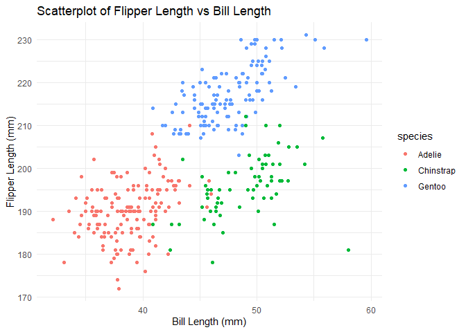

8105_hw1_xl3492
================
Xinyi Li
2024-09-12

``` r
# Import Dataset
data("penguins", package = "palmerpenguins")
```

``` r
# Load library
library(ggplot2)
library(palmerpenguins)
```

``` r
# Data Description
size_dataset <- paste(nrow(penguins), "rows and", ncol(penguins), "columns")
mean_flipper_length <- mean(penguins$flipper_length_mm, na.rm = TRUE)
name_important_vars <- names(penguins)

# Description Print
cat("The penguins dataset contains ", size_dataset, 
    " records of data. The important variables include", paste(name_important_vars, collapse = ", "),
    ". The mean flipper length is", round(mean_flipper_length, 2), "mm.")
```

    ## The penguins dataset contains  344 rows and 8 columns  records of data. The important variables include species, island, bill_length_mm, bill_depth_mm, flipper_length_mm, body_mass_g, sex, year . The mean flipper length is 200.92 mm.

``` r
# Create the scatterplot
scatter_plot <- ggplot(penguins, aes(x = bill_length_mm, y = flipper_length_mm, color = species)) +
  geom_point() +
  labs(title = "Scatterplot of Flipper Length vs Bill Length",
       x = "Bill Length (mm)",
       y = "Flipper Length (mm)") +
  theme_minimal()

# Display the plot
print(scatter_plot)
```

    ## Warning: Removed 2 rows containing missing values or values outside the scale range
    ## (`geom_point()`).

<!-- -->

``` r
# Export the plot to the working directory
ggsave("scatterplot_penguins.png", plot = scatter_plot)
```

    ## Saving 7 x 5 in image

    ## Warning: Removed 2 rows containing missing values or values outside the scale range
    ## (`geom_point()`).

``` r
# Create a random sample from a standard Normal distribution
set.seed(444)
random_sample <- rnorm(10)

# Create a logical vector indicating whether elements of the sample are greater than 0
logical_vector <- random_sample > 0

# Create a character vector of length 10
character_vector <- sample(letters, 10)

# Create a factor vector of length 10 with 3 different factor levels
factor_vector <- factor(sample(c("lvl1", "lvl2", "lvl3"), 10, replace = TRUE))

# Create the data frame
df <- data.frame(random_sample, logical_vector, character_vector, factor_vector)

print(df)
```

    ##    random_sample logical_vector character_vector factor_vector
    ## 1    -0.96188740          FALSE                z          lvl2
    ## 2    -0.28013727          FALSE                h          lvl1
    ## 3    -1.65587556          FALSE                j          lvl2
    ## 4     0.14954427           TRUE                s          lvl2
    ## 5     1.03241312           TRUE                g          lvl3
    ## 6    -0.51205156          FALSE                l          lvl2
    ## 7    -0.91991926          FALSE                o          lvl1
    ## 8    -0.95954816          FALSE                c          lvl3
    ## 9     1.33423450           TRUE                x          lvl1
    ## 10    0.08248588           TRUE                m          lvl1

``` r
# Trials to take the mean of each column
mean_random_sample <- mean(df$random_sample)
mean_logical_vector <- mean(df$logical_vector)
mean_character_vector <- try(mean(df$character_vector), silent = TRUE)  
```

    ## Warning in mean.default(df$character_vector): 参数不是数值也不是逻辑值：返回NA

``` r
mean_factor_vector <- try(mean(df$factor_vector), silent = TRUE)
```

    ## Warning in mean.default(df$factor_vector): 参数不是数值也不是逻辑值：返回NA

``` r
# Output the results
cat("Mean of random_sample:", mean_random_sample, "\n")
```

    ## Mean of random_sample: -0.2690741

``` r
cat("Mean of logical_vector:", mean_logical_vector, "\n")
```

    ## Mean of logical_vector: 0.4

``` r
cat("Mean of character_vector:", mean_character_vector, "\n")
```

    ## Mean of character_vector: NA

``` r
cat("Mean of factor_vector:", mean_factor_vector, "\n")
```

    ## Mean of factor_vector: NA

Since values of character_vector and factor_vector are neither numerical
nor logical. Hence, it will return errors. Instead, since values of
random_sample is numeric, then the mean is also numeric. And values of
logical_vector is the proportion of TRUE values (where TRUE is coerced
to 1 and FALSE to 0).
